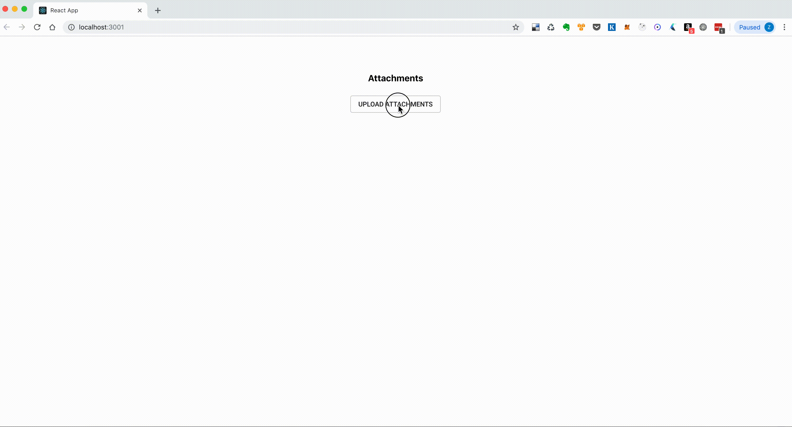

# S3PostUploader example
Example of upload application. The server is made with Koa js (https://koajs.com/) and
use `aws-sdk` package. The main component is in `src/components/Uploads`. The `src/S3PostUploader.jsx` component
is builded component from `yarn build` (removed flow types) and copied here to `example` for usage.

## Install dependencies
`$ yarn`

## Run
As first set correctly `awsConfig` credentials (`accessKeyId`, `secretAccessKey`, ...) in
`server.js` file.

Execute `yarn start-example`. The server  with react application will be started.

